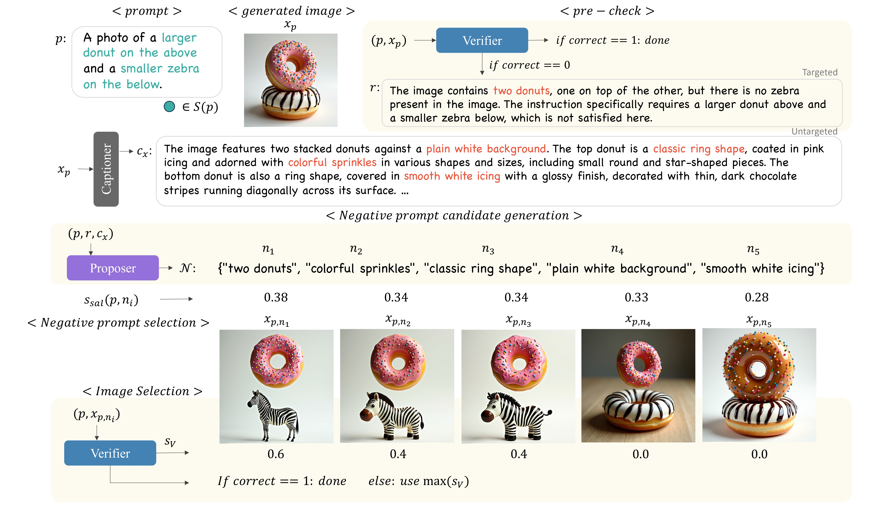

# NPC

NPC is a framework for **iterative negative prompt generation and correction**
using large language models and image verification.

---

## Overview

Given a text prompt and a generated image, NPC:

1. Verifies whether the image satisfies the prompt
2. If incorrect, analyzes the failure
3. Proposes candidate negative prompts
4. Re-generates images and selects the best result via verification scores

---

## Requirements

### Prompt
A **PROMPT** describing the target image is required.
This prompt is used for:
- Image generation
- Verification
- Negative prompt proposal

### OpenAI API
This project requires access to the **OpenAI API** for:
- Image captioning
- Negative prompt generation
- Image verification

Set your API key as an environment variable:

```bash
export OPENAI_API_KEY="your_api_key"
```

### Basic Run

```bash
python npc_demo.py \
  --prompt "A photorealistic scene of a modern, minimalist living room with three red spherical lamps above a gray sofa." \
  --seed 0 \
  --save-dir npc_demo
```
